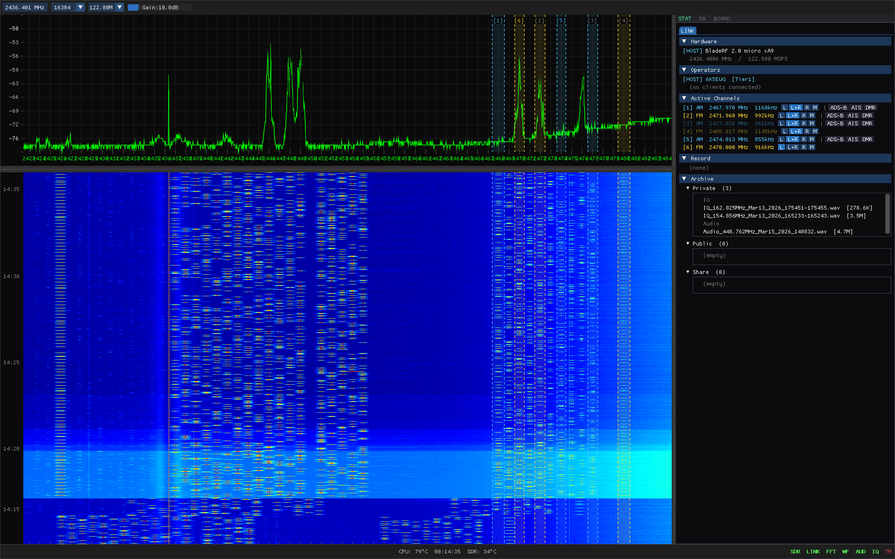
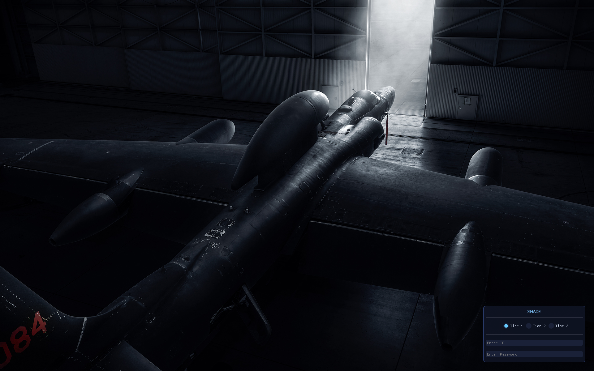
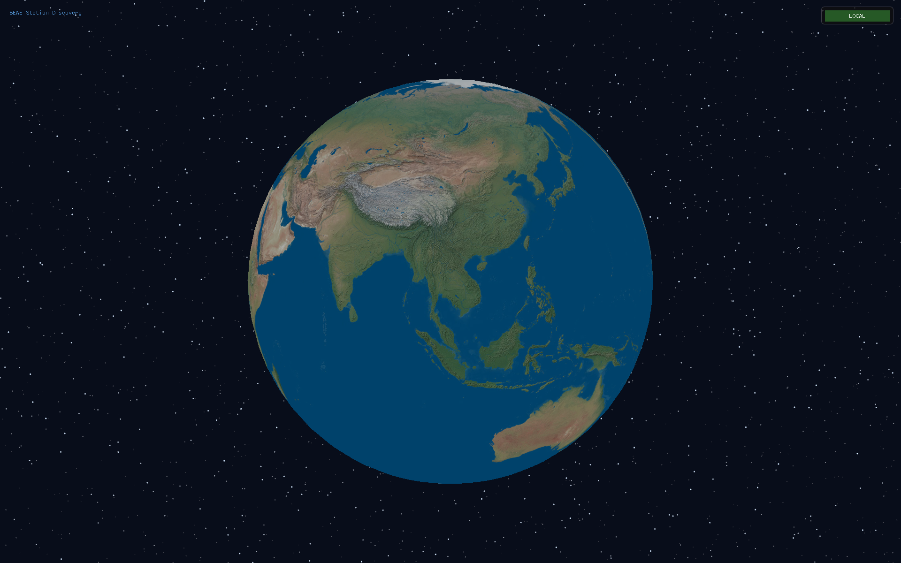
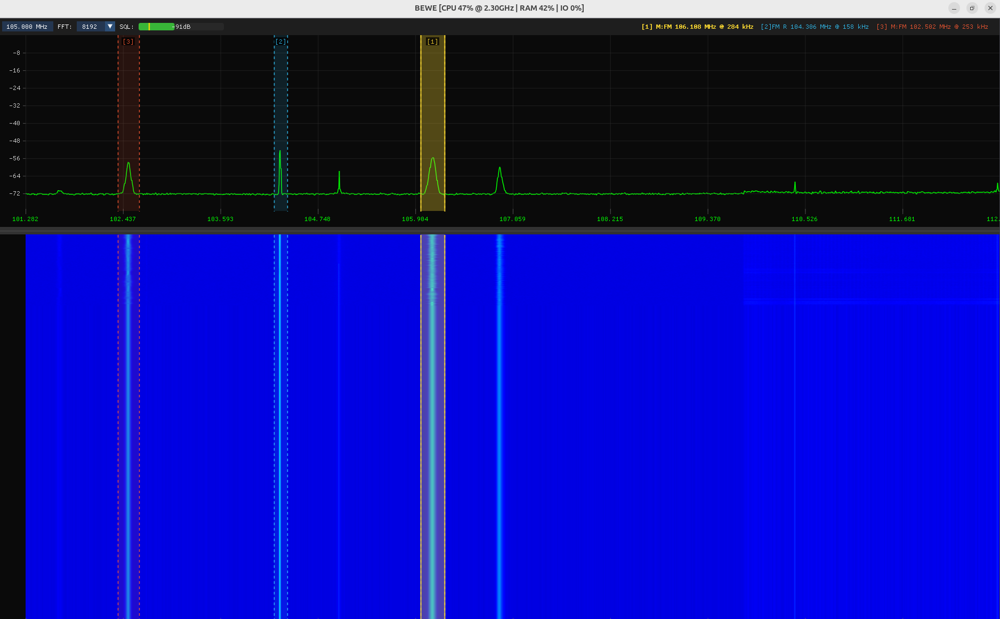
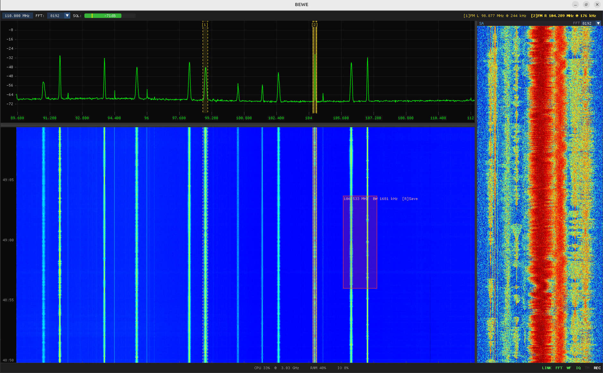
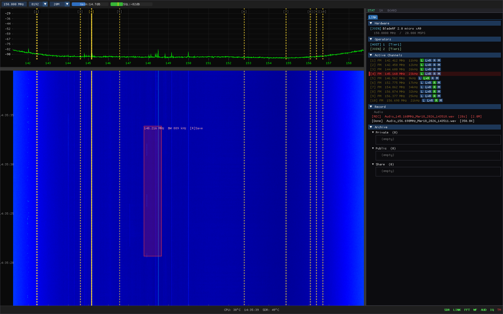
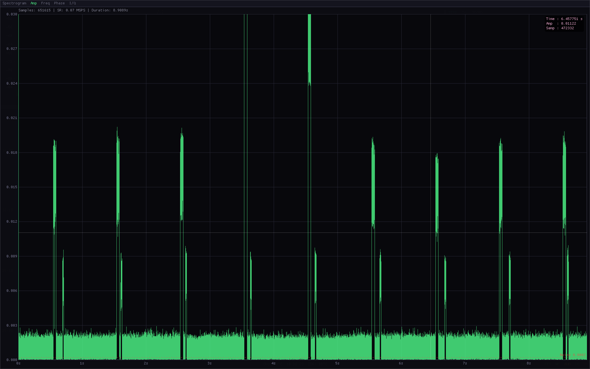
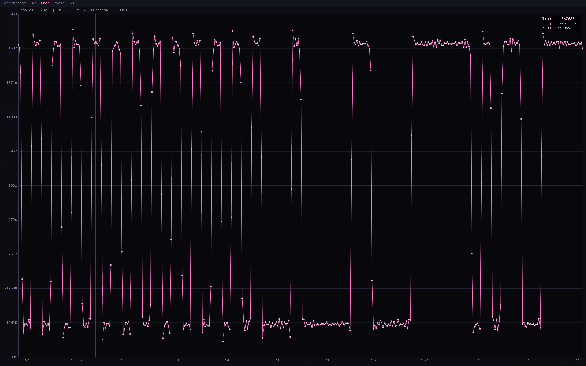
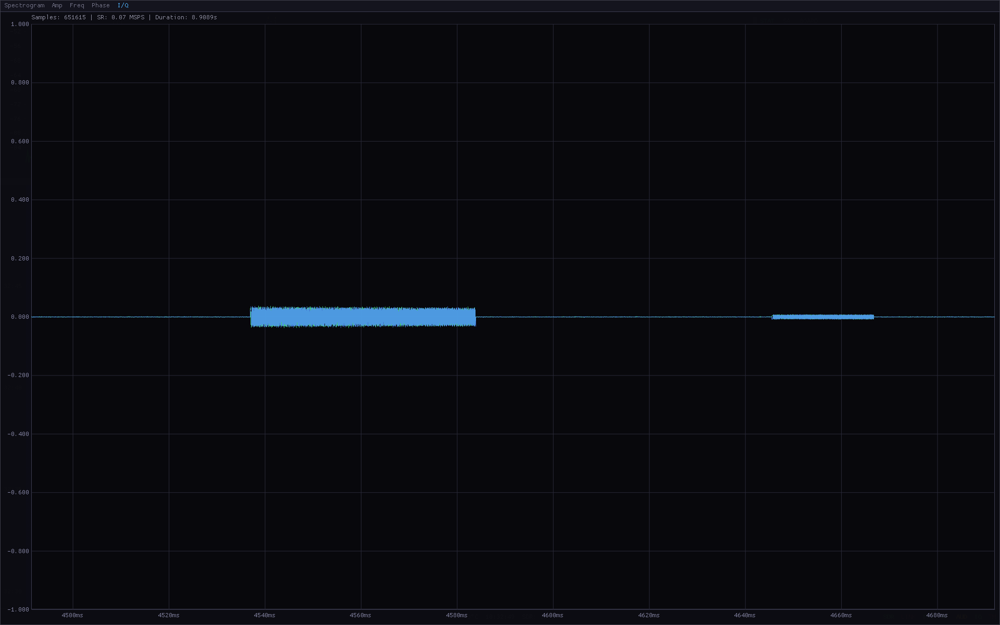

# BE_WE

> Multi-user SDR spectrum analyzer with real-time network streaming, signal analysis, and 3D station discovery.



---

## Table of Contents

- [Overview](#overview)
- [Why BE_WE](#why-be_we)
- [Screenshots](#screenshots)
- [Features](#features)
- [Signal Analyzer](#signal-analyzer)
- [EID Analysis](#eid-analysis)
- [Supported Hardware](#supported-hardware)
- [Architecture](#architecture)
- [Build](#build)
- [Usage](#usage)
- [Network Monitoring](#network-monitoring)
- [Raspberry Pi 5 Deployment](#raspberry-pi-5-deployment)
- [Troubleshooting](#troubleshooting)
- [Project Structure](#project-structure)

---

## Overview

BE_WE is a Linux-native SDR (Software Defined Radio) application built with C++17, OpenGL, and ImGui. A single HOST captures RF spectrum from an SDR device and streams it in real-time to multiple JOIN clients over TCP. Every operator sees the same live waterfall, can create channels, demodulate signals, chat, and share recordings — all from separate machines.

BE_WE also supports **CLI mode** — deploy a Raspberry Pi 5 as a remote HOST base station with zero display dependencies. JOIN clients connecting to a CLI HOST see absolutely no difference from a GUI HOST.

---

## Why BE_WE

Most SDR applications are designed for a single operator on a single machine. BE_WE is built from the ground up for **distributed, multi-operator environments**.

- **Multi-User Collaboration** — Multiple operators work on the same spectrum simultaneously. Each can independently create channels, tune demodulators, control audio, and record. Built-in chat, file sharing, and tier-based permissions make it a true multiplayer SDR platform.
- **3D Globe Station Discovery** — Stations appear as markers on an interactive 3D globe. Click to connect — no IP addresses needed. LAN stations auto-discovered via UDP; WAN stations reachable through the central relay.
- **Time Machine** — 60-second rolling IQ buffer to disk. Press `Space` to freeze and scroll back. Missed a signal 30 seconds ago? It's still there.
- **Selective Region IQ Export** — `Ctrl+Right-drag` on the waterfall to export only a specific time-frequency region. Combined with Time Machine, retroactively extract signals of interest without full wideband capture.
- **Signal Analysis** — Built-in offline analyzer for WAV/IQ files with multi-domain views: spectrogram, amplitude, instantaneous frequency, and raw I/Q.
- **EID Fingerprinting** — Emitter Identification system extracts RF characteristics (envelope, phase, instantaneous frequency) for transmitter authentication.

---

## Screenshots

| Login | Globe (Station Discovery) |
|:---:|:---:|
|  |  |

| Spectrum + Waterfall | Wideband Overview |
|:---:|:---:|
|  |  |

| Time Machine + Region Export |
|:---:|
|  |

| Amplitude Domain | Frequency Domain | I/Q View |
|:---:|:---:|:---:|
|  |  |  |

---

## Features

### Spectrum & Waterfall
- Real-time FFT with configurable size (default 8192)
- GPU-accelerated waterfall display with 2500-row history (~60 s)
- Frequency zoom / pan / drag-scroll
- Auto-scale and manual power range control
- Time-stamped event tags on waterfall (5 s interval)

### Demodulation
- **Analog** — AM, FM, MAGIC (auto-detect AM/FM/DSB/SSB/CW)
- **Digital** — AIS (marine vessel tracking), LoRa
- Up to 10 simultaneous channels with independent mode selection

### Audio
- 48 kHz stereo output via ALSA
- Per-channel pan control (L / Center / R / Mute)
- Per-operator audio routing (32-bit bitmask)
- Squelch with auto-calibration and gate hold
- 5 noise reduction algorithms: Spectral Subtraction, Spectral Gate, Wiener Filter, MMSE-STSA, Log-MMSE

### Time Machine
- 60-second rolling IQ buffer to disk (toggle with `T`)
- Freeze & seek through waterfall history (`Space`)
- Region selection (`Ctrl+Right-drag`) for IQ export
- IQ_CHUNK transfer: WAN-compatible file streaming via MUX relay

### Recording
- **Per-Channel IQ Recording** — Press `I` on an active channel to start squelch-gated IQ capture at the channel's intermediate sample rate; stops automatically when squelch closes or `I` pressed again
- **Scheduled Recording** — Configure time-based automatic IQ recording (frequency, bandwidth, duration, start time); status tracks WAITING → RECORDING → COMPLETED
- **Live Analysis During Recording** — WAV headers updated every 65,536 samples; right-click any active recording in the Recording panel to open it in Signal Analyzer without stopping the capture

### LOG Panel
- Press `L` to toggle a full-screen real-time log overlay
- Two-column layout: HOST events (green) and SERVER events (orange)
- Live TX/RX network rate display; auto-scrolls with latest events

### Network Streaming (HOST / JOIN)
- HOST broadcasts FFT + audio over TCP; JOIN receives with jitter buffer
- Per-client async send queues with priority (control > FFT > audio)
- Tier-based authentication (Tier 1 / 2 / 3)
- Bi-directional commands: JOIN can tune frequency, create channels, control gain
- Dynamic FFT size and sample rate changes from JOIN
- Real-time network monitoring: TX/RX throughput, packet drops, queue depth, audio underruns

### CLI Host
- Compile-time `-DCLI=ON` flag — zero OpenGL/GLFW/ImGui dependencies
- Interactive prompt-based startup (ID, password, tier, station, coordinates, frequency)
- Full backend: FFT, demodulation, audio, network, discovery, central relay — all identical to GUI HOST
- stdin command loop: `/status`, `/clients`, `/chassis 1 reset`, `/rx stop`, `/shutdown`
- Designed for Raspberry Pi 5 remote base station deployment

### Station Discovery & Globe
- 3D interactive globe with Blue Marble texture
- UDP broadcast discovery on LAN
- Central relay server for all connections (single port 7700) — no direct TCP required

### Window Management
- Starts in windowed mode by default (1400×900)
- `F11` toggles fullscreen; restores previous window position and size on exit

### Collaboration
- Real-time chat between all connected operators
- File sharing (upload / download recordings via public directory)
- Operator list with tier and connection status
- Channel ownership tracking

---

## Signal Analyzer

Open exported WAV/IQ files for offline multi-domain analysis. Switch between views using tabs at the top of the analyzer window.

| View | Description |
|------|-------------|
| **Spectrogram** | Full FFT spectrogram with Hann window, Jet colormap, zoom/pan, and region selection |
| **Amplitude** | Time-domain envelope waveform — visualize signal bursts, keying patterns, and pulse timing |
| **Frequency** | Instantaneous frequency plot — identify FSK deviation, modulation index, and symbol timing |
| **I/Q** | Raw In-phase / Quadrature sample view — inspect baseband signal structure and DC offset |

- Demodulate and play back selected regions directly in the analyzer
- Auto-scale with percentile-based range (1st–99th)
- Sample-accurate cursor with time, amplitude, and sample index readout

| Amplitude Domain | Frequency Domain | I/Q View |
|:---:|:---:|:---:|
|  |  |  |

---

## EID Analysis

**EID (Emitter Identification)** extracts RF-level characteristics from recorded signals for transmitter fingerprinting.

From a single WAV/IQ file, EID computes:

| Domain | Key | Extraction |
|--------|-----|-----------|
| **Envelope** | `1` | Amplitude envelope `√(I² + Q²)` — turn-on/off transient shape unique to each transmitter |
| **I/Q** | `2` | Raw in-phase and quadrature components — DC offset, gain imbalance signatures |
| **Phase** | `3` | Instantaneous phase `atan2(Q, I)` — phase noise and unwrap characteristics |
| **Inst. Frequency** | `4` | Phase derivative scaled to Hz — frequency settling behavior at key-up |
| **Constellation** | `5` | I/Q constellation plot with automatic carrier recovery (linear regression on cumulative phase) |
| **M-th Power Spectrum** | `6` | High-order (M=1/2/4/8) power spectrum for cyclostationary feature extraction |

Each domain uses automatic 1st–99th percentile scaling with 5% margin for consistent visualization regardless of signal level. Noise floor is estimated at the 5th percentile for reference. View range is synchronized across all modes.

### Band Pass Filter

Apply an FFT-based brick-wall band pass filter before analysis:
- Configure high-pass and low-pass cutoff frequencies (Hz)
- Always filters from original data — no cascading degradation
- Recomputes all derived domains (envelope, phase, instantaneous frequency) after filtering
- Undo restores the original unfiltered signal

### Constellation View

Visualize the baseband I/Q signal on a Cartesian plot:
- **Auto Carrier Recovery** — estimates and removes carrier frequency offset via linear regression on the unwrapped phase slope
- Manual zoom mode and configurable window size
- Unit circle and grid overlay for reference

### M-th Power Spectrum

Raises the complex signal to the M-th power before computing the DFT:
- M=1 (normal), M=2, M=4, M=8
- Higher orders reveal hidden cyclostationary features obscured in the linear spectrum
- Useful for blind modulation classification and symbol rate estimation

### Arrow Key Sweep (Phase View)

In the Phase view, manually adjust carrier offset for detrending:
- `←` / `→` — ±1 Hz per step
- `↑` / `↓` — ±10 Hz per step

Use cases:
- Verify transmitter identity by comparing RF fingerprints
- Detect spoofed or cloned transmitters
- Characterize oscillator stability and modulation quality
- Blind modulation classification via cyclostationary analysis

---

## Supported Hardware

| Device | Frequency Range | Gain | Format |
|--------|----------------|------|--------|
| **BladeRF** | 47 MHz – 6 GHz | 0 – 60 dB | SC16_Q11 |
| **ADALM-Pluto** | 70 MHz – 6 GHz | 0 – 71 dB | SC16 (12-bit) |
| **RTL-SDR** | 500 kHz – 1.766 GHz | 0 – 49.6 dB (29 steps) | uint8 offset binary |

Hardware is auto-detected at startup (priority: BladeRF → Pluto → RTL-SDR). If no SDR is found, you can still JOIN a remote HOST. The active SDR can be switched at runtime without restarting (HOST/LOCAL: click the Receiver field).

---

## Architecture

### System Overview

```
 ┌──────────┐         ┌──────────┐         ┌──────────┐
 │  HOST A  │         │  HOST B  │         │  HOST C  │
 │  (SDR)   │         │  (SDR)   │         │  (SDR)   │
 └────┬─────┘         └────┬─────┘         └────┬─────┘
      │ WAN                │ WAN                │ WAN
      │   ┌────────────────┴────────────────┐   │
      └───┤       CENTRAL RELAY SERVER      ├───┘
          │          port 7700 (MUX)         │
          │          port 7702 (IQ Pipe)     │
          └──┬──────────┬──────────┬────────┘
             │          │          │
          ┌──┴──┐    ┌──┴──┐   ┌──┴──┐
          │JOIN │    │JOIN │   │JOIN │
          │  1  │    │  2  │   │  3  │
          └─────┘    └─────┘   └─────┘
```

### Central Relay Server Detail

```
┌──────────────────────────────────────────────────────┐
│                 CENTRAL RELAY SERVER                  │
│                                                      │
│  ┌─────────────┐       ┌───────────────────────────┐ │
│  │ Room Manager │       │     MUX Adapter           │ │
│  │             │       │                           │ │
│  │ • station   │       │  HOST fd ←→ socketpair    │ │
│  │   registry  │       │       ↕  BRLY MUX hdr     │ │
│  │ • list resp │       │  JOIN₁ fd  (conn_id 1)    │ │
│  │ • heartbeat │       │  JOIN₂ fd  (conn_id 2)    │ │
│  │             │       │  JOIN₃ fd  (conn_id 3)    │ │
│  └─────────────┘       │                           │ │
│                        │  Broadcast: conn_id=0xFFFF │ │
│  ┌─────────────────────┴───────────────────────────┐ │
│  │  Per-JOIN Send Queue (priority-based)           │ │
│  │  ctrl_queue > send_queue(FFT) > audio_queue     │ │
│  │  FFT: 2MB cap (drop oldest) │ Audio: 512KB cap  │ │
│  └─────────────────────────────────────────────────┘ │
│                                                      │
│  ┌─────────────────────────────────────────────────┐ │
│  │  IQ Pipe Bridge (port 7702)                     │ │
│  │  PIPE_HOST (req_id) ←→ PIPE_JOIN (req_id)       │ │
│  │  Matched by req_id → bidirectional relay        │ │
│  └─────────────────────────────────────────────────┘ │
└──────────────────────────────────────────────────────┘
```

### Connection Modes

All connections are routed through the central relay server — no direct TCP between HOST and JOIN is required.

```
 All connections (LAN + WAN)
 ────────────────────────────
 HOST ──TCP:7700──→ RELAY ──→ JOIN
                  BRLY MUX protocol
                  Single port, N clients
```

| Port | Role | Description |
|------|------|-------------|
| **7700** | Central Relay | MUX relay — HOST registers station, JOINs connect via relay |
| **7701** | HOST ↔ JOIN | BEWE protocol (relay-forwarded; not exposed externally) |
| **7702** | IQ Pipe | Dedicated IQ file transfer between HOST and JOIN (relay-forwarded) |

### Protocol

- HOST ↔ JOIN: custom binary protocol (`BEWE` magic) over TCP
- Central relay: `BRLY` magic with MUX headers to multiplex JOINs over one HOST connection
- LAN discovery: UDP broadcast on local subnet
- IQ Pipe: `PIPE` magic with req_id matching for HOST↔JOIN file transfer

---

## Build

### Requirements

- Linux (tested on Ubuntu 24.04)
- CMake 3.16+
- C++17 compiler (GCC 9+ / Clang 10+)

### System Dependencies

```bash
# Build tools
sudo apt install -y build-essential cmake pkg-config

# SDR libraries
sudo apt install -y libbladerf-dev librtlsdr-dev

# ADALM-Pluto (AD936x) — required for Pluto support
sudo apt install -y libiio-dev libad9361-dev

# DSP / Audio
sudo apt install -y libfftw3-dev libasound2-dev libmpg123-dev libvolk-dev

# Graphics
sudo apt install -y libglew-dev libglfw3-dev libgl-dev libpng-dev

# Image loading
sudo apt install -y libstb-dev
```

### One-liner (all deps — GUI)

```bash
sudo apt install -y build-essential cmake pkg-config \
  libbladerf-dev librtlsdr-dev libiio-dev libad9361-dev \
  libfftw3-dev libasound2-dev libmpg123-dev libvolk-dev \
  libglew-dev libglfw3-dev libgl-dev libpng-dev libstb-dev
```

### One-liner (CLI only — no GPU required)

```bash
sudo apt install -y build-essential cmake pkg-config \
  libbladerf-dev librtlsdr-dev libiio-dev libad9361-dev \
  libfftw3-dev libasound2-dev libmpg123-dev libvolk-dev libpng-dev
```

### Compile — GUI (default)

```bash
git clone https://github.com/6K5EUQ/BE_WE.git
cd BE_WE
mkdir build && cd build
cmake ..
make -j$(nproc)
./BE_WE
```

### Compile — CLI Host

```bash
git clone https://github.com/6K5EUQ/BE_WE.git
cd BE_WE
mkdir build_cli && cd build_cli
cmake -DCLI=ON ..
make -j$(nproc)
./BE_WE
```

> **Note:** The CLI binary has zero OpenGL/GLFW/ImGui dependencies. It runs HOST mode only with an interactive prompt-based startup. JOIN clients see no difference from a GUI HOST.

---

## Usage

### HOST Mode

1. Launch `./BE_WE`
2. Log in with ID / Password and select a Tier (`Ctrl+1` / `Ctrl+2` / `Ctrl+3`)
3. Click your location on the 3D globe, then press **HOST**
4. SDR starts automatically — spectrum and waterfall appear
5. Other users can now JOIN your station

### JOIN Mode

1. Launch `./BE_WE` on a different machine (no SDR required)
2. Log in and select a Tier
3. Stations appear on the globe via UDP discovery or relay
4. Click a station marker and press **JOIN**
5. Live spectrum, audio, and channels stream in real-time

### CLI Host Mode

1. Build with `cmake -DCLI=ON`
2. Run `./BE_WE` — interactive prompts guide you through setup:

```
=== BE_WE CLI HOST ===

ID: junseo.park
Password: ****
Tier (1/2) [1]:
Central server [20.2.86.135]:
Station name: DGS-5
Latitude [0.0]: 37.56
Longitude [0.0]: 126.97
Center freq MHz [450.0]: 140

[BEWE CLI] Login: junseo.park (Tier 1)
[BEWE CLI] SDR: RTL-SDR detected
[BEWE CLI] Server started on port 7701
[BEWE CLI] Ready. Type /help for commands.
```

Defaults shown in `[]` — press Enter to accept.

#### CLI Commands

| Command | Action |
|---------|--------|
| `/status` | CF, SR, gain, SDR state, clients, CPU/RAM, network stats |
| `/clients` | Connected operator list with tier info |
| `/chassis 1 reset` | USB SDR hardware reset |
| `/chassis 2 reset` | Network broadcast reset |
| `/rx stop` | Stop SDR capture |
| `/rx start` | Resume SDR capture |
| `/shutdown` | Clean shutdown |
| `/help` | Show available commands |
| *(free text)* | Broadcast as chat message to all JOINs |

System status is printed automatically every 30 seconds.

### Key Bindings

| Key | Action |
|-----|--------|
| `T` | Toggle IQ rolling recording (Time Machine) |
| `Space` | Freeze waterfall and enter Time Machine view |
| `Scroll` | Zoom frequency axis |
| `Ctrl+Right-drag` | Select region for IQ export |
| `I` | Toggle per-channel IQ recording on selected channel (squelch-gated) |
| `D` | Toggle digital decode panel for selected channel |
| `L` | Toggle LOG panel (real-time HOST/SERVER log overlay) |
| `F11` | Toggle fullscreen / windowed mode |
| `Ctrl+1/2/3` | Select Tier on login screen |
| `← / →` *(EID Phase)* | Carrier offset sweep ±1 Hz per step |
| `↑ / ↓` *(EID Phase)* | Carrier offset sweep ±10 Hz per step |

---

## Network Monitoring

Real-time network traffic analysis is available in both GUI and CLI modes. Use it to diagnose audio stuttering, packet loss, or bandwidth issues.

### GUI (STAT > LINK > Network)

| Role | Metrics |
|------|---------|
| **HOST** | TX/RX total + rate (MB/s), dropped packets, FFT queue depth, audio queue depth |
| **JOIN** | RX/TX total + rate (MB/s), audio underrun count, jitter buffer fill level |

- **Drops increasing** → HOST upload bottleneck (TCP send buffer full)
- **Underruns increasing** → JOIN download bottleneck (jitter buffer starved)

### CLI (`/status` command)

```
NET: TX=45.2 MB  RX=1.8 KB  Drops=0  Q(fft=1 audio=0)
```

Also included in the 30-second automatic status line.

---

## Raspberry Pi 5 Deployment

Deploy a Pi 5 as a CLI remote HOST base station.

### Quick Start

```bash
# 1. Install CLI dependencies
sudo apt install -y build-essential cmake pkg-config \
  libbladerf-dev librtlsdr-dev libfftw3-dev libasound2-dev \
  libmpg123-dev libvolk-dev libpng-dev

# 2. Clone and build
cd ~ && git clone https://github.com/6K5EUQ/BE_WE.git
cd BE_WE && mkdir build_cli && cd build_cli
cmake -DCLI=ON .. && make -j4

# 3. Apply performance tuning
sudo bash ~/BE_WE/setup_pi_performance.sh
sudo reboot

# 4. Run
cd ~/BE_WE/build_cli
./BE_WE
```

### Performance Tuning (`setup_pi_performance.sh`)

The included script configures the Pi for maximum performance with zero power saving:

| Setting | Change | Effect |
|---------|--------|--------|
| CPU governor | `ondemand` → `performance` | Locked at max clock (2.4 GHz) |
| WiFi power save | `on` → `off` | Eliminates network latency spikes |
| USB autosuspend | `2s` → `disabled` | Prevents SDR disconnects |
| VM swappiness | `60` → `10` | Minimizes swap thrashing |
| zswap | `enabled` → `disabled` | Removes compression CPU overhead |
| GPU memory | default → `16 MB` | Frees RAM for DSP (CLI needs no GPU) |
| IO scheduler | `mq-deadline` → `none` | Lowest disk latency |
| Unused services | bluetooth, cups, ModemManager | Disabled — frees CPU and memory |
| Network buffers | default → `16 MB rmem/wmem` | Higher throughput for streaming |

All settings persist across reboots. Run once and forget.

### RTL-SDR Thermal Note

The Pi 5 runs hot under `force_turbo=1`. If your RTL-SDR runs warm, use a short USB extension cable (10–20 cm) to physically separate it from the Pi's heat. A small heatsink on the RTL-SDR also helps.

---

## Troubleshooting

### WiFi: Choppy / stuttering spectrum on JOIN

If the waterfall scrolls in bursts instead of smoothly, WiFi power management is likely batching incoming packets.

**Check:**
```bash
iwconfig 2>/dev/null | grep "Power Management"
```

**Fix (immediate):**
```bash
sudo iwconfig <interface> power off
```

**Fix (permanent):**
```bash
sudo tee /etc/NetworkManager/conf.d/wifi-powersave-off.conf <<'EOF'
[connection]
wifi.powersave = 2
EOF
sudo systemctl restart NetworkManager
```

### `glxinfo` shows software renderer (`llvmpipe`)

You're running without GPU acceleration. Install the proper driver:

```bash
# NVIDIA
sudo apt install nvidia-driver-535

# Intel / AMD
sudo apt install mesa-vulkan-drivers
```

### BladeRF not detected

```bash
# Check USB connection
lsusb | grep Nuand

# Permissions: add udev rule
sudo tee /etc/udev/rules.d/88-bladerf.rules <<'EOF'
ATTR{idVendor}=="2cf0", ATTR{idProduct}=="5246", MODE="0660", GROUP="plugdev"
EOF
sudo udevadm control --reload-rules
# Re-plug the device
```

### ADALM-Pluto not detected

```bash
# USB 연결 확인
lsusb | grep Analog

# libiio 컨텍스트 스캔 테스트
iio_info -s

# "Bad URI: 'usb:'" 출력은 정상 — Pluto 미연결 시 scan 과정에서 발생하는 메시지
```

### RTL-SDR claimed by kernel DVB driver

```bash
sudo modprobe -r dvb_usb_rtl28xxu
# To make permanent:
echo "blacklist dvb_usb_rtl28xxu" | sudo tee /etc/modprobe.d/blacklist-rtlsdr.conf
```

### Build error: package not found

See [System Dependencies](#system-dependencies) above. All required packages:

| CMake package | apt package |
|---|---|
| `libbladeRF` | `libbladerf-dev` |
| `fftw3f` | `libfftw3-dev` |
| `alsa` | `libasound2-dev` |
| `libmpg123` | `libmpg123-dev` |
| `librtlsdr` | `librtlsdr-dev` |
| `libiio` | `libiio-dev` |
| `libad9361` | `libad9361-dev` |
| `volk` | `libvolk-dev` |
| `libpng` | `libpng-dev` |
| OpenGL | `libgl-dev` |
| GLEW | `libglew-dev` |
| glfw3 | `libglfw3-dev` |

---

## Project Structure

```
BE_WE/
├── src/
│   ├── main.cpp              # Entry point
│   ├── ui.cpp                # ImGui UI (login, globe, spectrum, panels)
│   ├── fft_viewer.hpp/cpp    # FFT computation & waterfall rendering
│   ├── bladerf_io.cpp        # BladeRF SDR capture
│   ├── rtlsdr_io.cpp         # RTL-SDR capture
│   ├── pluto_io.cpp          # ADALM-Pluto SDR capture
│   ├── hw_detect.cpp         # Hardware auto-detection
│   ├── hw_config.hpp         # Runtime hardware parameters
│   ├── demod.cpp             # AM / FM / MAGIC demodulation
│   ├── audio.hpp/cpp         # ALSA output + 5 noise reduction algorithms
│   ├── ais.cpp               # AIS digital decoder
│   ├── lora_demod.cpp/hpp    # LoRa demodulator
│   ├── sa_compute.cpp        # Signal Analyzer offline FFT
│   ├── eid_compute.cpp       # EID transmitter fingerprint analysis
│   ├── net_protocol.hpp      # Binary protocol specification (BEWE)
│   ├── net_server.hpp/cpp    # HOST-side TCP server
│   ├── net_client.hpp/cpp    # JOIN-side TCP client
│   ├── net_stream.cpp        # Stream utilities
│   ├── central_client.hpp/cpp # Central relay client
│   ├── iq_pipe_server.hpp/cpp # IQ file transfer server (port 7702)
│   ├── udp_discovery.hpp/cpp # LAN station broadcast
│   ├── globe.hpp/cpp         # 3D Earth renderer (OpenGL 3.3)
│   ├── timemachine.cpp       # IQ rolling record & playback
│   ├── region_save.cpp       # Region IQ export
│   ├── iq_record.cpp         # IQ / audio recording + per-channel squelch-gated recording
│   ├── cli_host.cpp          # CLI host mode
│   ├── login.hpp/cpp         # Authentication & tier selection
│   ├── channel.hpp           # Per-channel state
│   ├── config.hpp            # Global constants
│   ├── bewe_paths.hpp        # Path management
│   └── world_map_data.hpp    # Embedded vector map for globe
├── central/
│   ├── central_main.cpp      # Standalone central relay server
│   ├── central_server.hpp/cpp # Central relay implementation
│   ├── central_proto.hpp     # Central relay protocol (BRLY + MUX)
│   └── CMakeLists.txt
├── libs/
│   └── imgui/                # Dear ImGui (embedded)
├── assets/
│   ├── BEWE.png              # Logo / main screenshot
│   ├── earth.jpg             # Blue Marble texture
│   ├── Amp_Domain.png        # Signal Analyzer: amplitude domain
│   ├── Freq_Domain.png       # Signal Analyzer: frequency domain
│   ├── IQ_Analy.png          # Signal Analyzer: I/Q view
│   └── *.png                 # UI screenshots & login backgrounds
├── setup_pi_performance.sh   # Raspberry Pi 5 performance tuning script
└── CMakeLists.txt
```

---

## Data Directory

BE_WE stores recordings and data files under `$HOME/BE_WE/`:

```
$HOME/BE_WE/
├── recordings/
│   ├── record/          # Current session recordings
│   │   ├── iq/
│   │   └── audio/
│   ├── private/         # Previous session recordings
│   │   ├── iq/
│   │   └── audio/
│   ├── public/          # Files shared via server
│   │   ├── iq/
│   │   └── audio/
│   ├── share/           # Files downloaded from public
│   │   ├── iq/
│   │   └── audio/
│   └── Time_temp/       # Time Machine rolling IQ buffer
└── assets/              # Fallback asset directory
```

Directories are created automatically on startup.

---

## License

TBD
