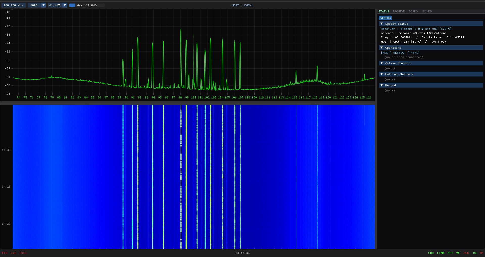
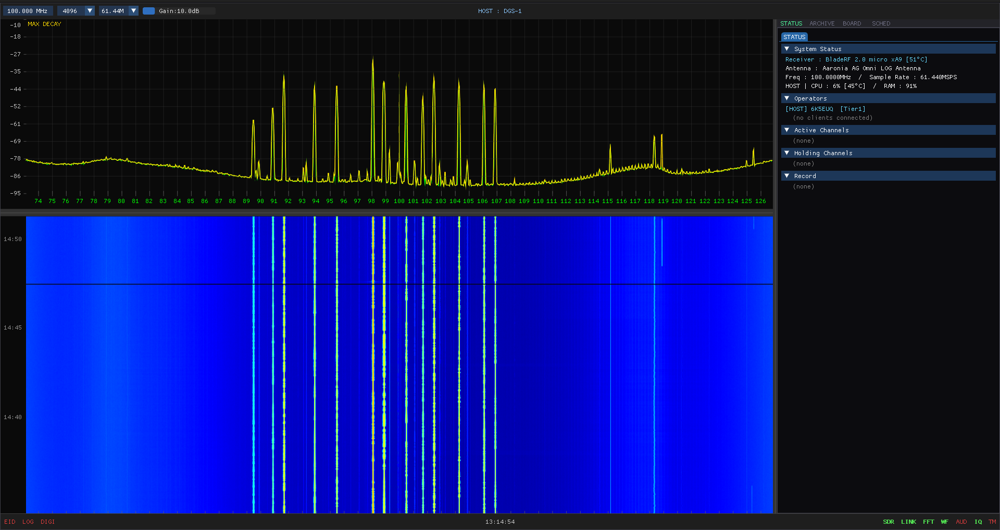
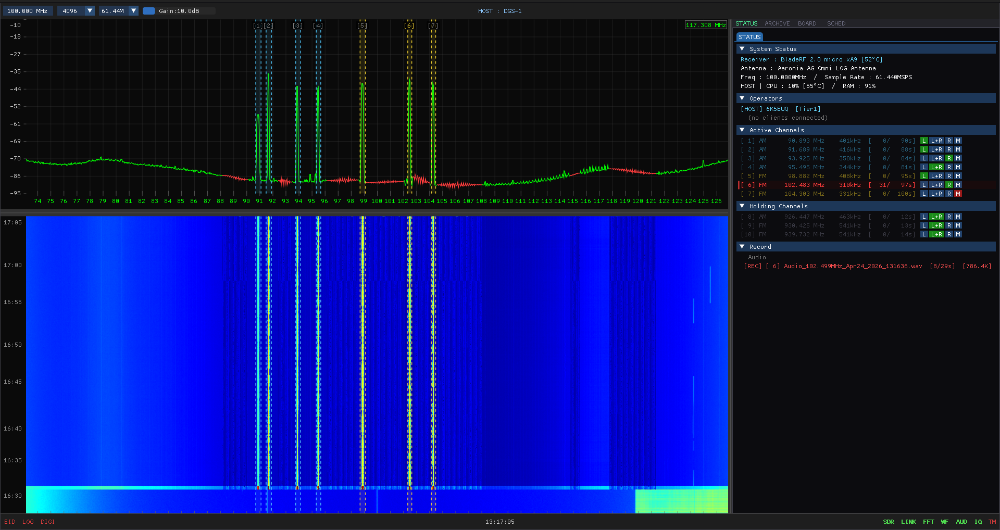
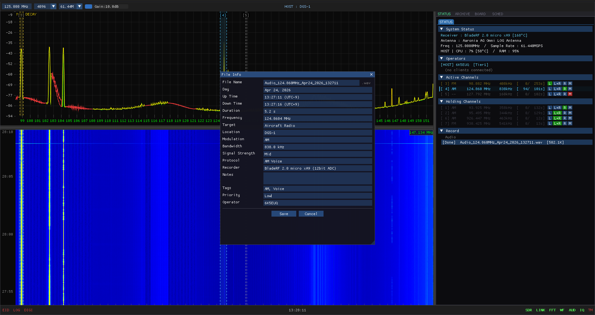
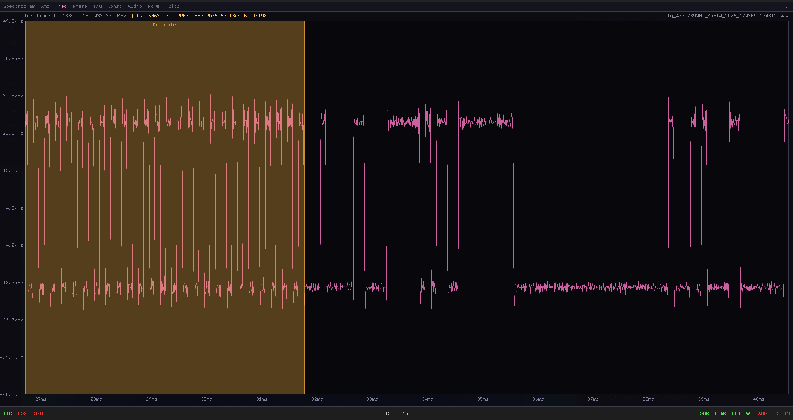
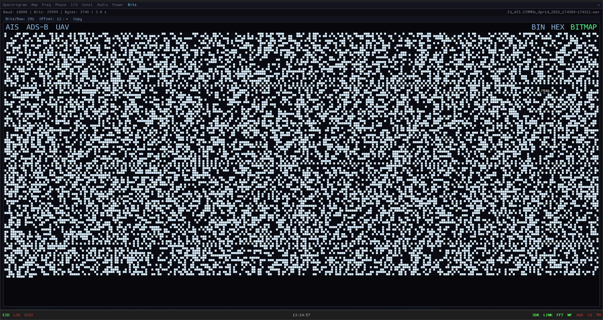

# BE_WE

> Multi-user SDR spectrum analyzer with real-time network streaming, signal analysis, and 3D station discovery.


---

## Table of Contents

- [What is BE_WE](#what-is-be_we)
- [Feature Tour](#feature-tour)
- [Signal Analyzer](#signal-analyzer)
- [EID — Emitter Identification](#eid--emitter-identification)
- [Supported Hardware](#supported-hardware)
- [Build & Quick Start](#build--quick-start)
- [Key Bindings](#key-bindings)
- [Raspberry Pi 5 Deployment](#raspberry-pi-5-deployment)
- [Troubleshooting](#troubleshooting)

---

## What is BE_WE

A Linux-native SDR app where **one HOST captures RF and many JOIN clients watch the same live spectrum together** — create channels, demodulate, chat, and share recordings from separate machines. A headless **CLI HOST** build turns a Raspberry Pi 5 into a remote base station indistinguishable from a GUI HOST.

- **Multi-user** — every operator sees the same waterfall; channels, chat, and file sharing are live
- **3D Globe discovery** — click a station marker, no IP addresses
- **Time Machine** — 60-second IQ rewind; recover the signal you just missed
- **Signal Analyzer + EID** — offline multi-domain inspection and RF fingerprinting
- **Central relay** — single port (7700), no LAN/WAN configuration

---

## Feature Tour

### Spectrum + Waterfall

Live FFT with a GPU waterfall. Drag to pan, scroll to zoom, auto-scale or lock the range.



### Max Hold & Max Decay

Click the power axis to cycle through peak-holding modes. Sweep a band once and every signal that appeared stays visible — with optional fade so you can tell old peaks from new ones.



### Channels, Holding List, and Notch Filters

Up to 10 demodulator channels at once (AM / FM / MAGIC, AIS, LoRa). Retune away from a channel and it slides into the **Holding** list with its squelch timer intact — come back and it rejoins automatically. Unwanted carriers can be killed with a global **Notch filter pool** that persists across sample-rate changes.



### Time Machine & Region IQ Export

Press `T` for a 60-second rolling IQ buffer, `Space` to freeze and scroll back, and `Ctrl+Right-drag` on the waterfall to export just that time-frequency region as an IQ file.


### Recording with Auto-Populated File Info

Per-channel IQ capture is squelch-gated — press `I` and stop thinking about it. Scheduled recordings fire on time, the WAV is live-analyzable while it records, and a **File Info** modal auto-fills frequency, bandwidth, modulation, recorder, and UTC up/down times so your archive stays self-describing.



### Collaboration

Real-time chat, file sharing, tier-based permissions, per-channel audio routing to specific operators. JOINs can re-tune the HOST, change FFT size, and control gain when permitted.

### Headless CLI HOST

Compile with `-DCLI=ON` for a zero-GPU build. Interactive prompt-based startup; `/status`, `/clients`, `/shutdown` commands; free text broadcasts as chat.

---

## Signal Analyzer

Open any WAV/IQ file for offline inspection. Tabs across the top switch domains:
`Spectrogram · Amp · Freq · Phase · I/Q · Const · Audio · Power · Bits`

### Spectrogram

Jet-colored FFT-vs-time with region select, zoom/pan, and selectable window (Hann / Blackman-Harris).


### Freq — Preamble Detection + PRI / PRF

Instantaneous frequency view auto-detects a repeating preamble and reports **PRI / PRF / Pulse Duration / Baud** — characterize an unknown FSK or pulsed signal in seconds.



### Bits — BIN / HEX / BITMAP + Protocol Decoders

Demodulated bit stream rendered as a 2D bitmap — frame sync patterns and scramblers become visually obvious. One-click decoders for **AIS / ADS-B / UAV**.



### Other Tabs

- **Amp** — envelope (bursts, keying, pulse timing)
- **Phase** — instantaneous phase with `←/→` / `↑/↓` carrier offset sweep
- **I/Q** — raw baseband
- **Const** — constellation with automatic carrier recovery
- **Audio** — demodulated WAV playback inside the analyzer
- **Power** — M-th power spectrum (M = 1 / 2 / 4 / 8) for cyclostationary analysis

---

## EID — Emitter Identification

Extracts RF-level fingerprints (envelope, I/Q, phase, instantaneous frequency, constellation, M-th power spectrum) from a single WAV/IQ. Press keys `1`–`6` to flip between domains. Built-in band-pass filter, arrow-key carrier sweep, and percentile-based auto-scaling so different files compare fairly.

Use it to verify transmitter identity, detect spoofed or cloned radios, and characterize oscillator stability.

---

## Supported Hardware

| Device | Frequency Range | Gain |
|---|---|---|
| **BladeRF** | 47 MHz – 6 GHz | 0 – 60 dB |
| **ADALM-Pluto** | 70 MHz – 6 GHz | 0 – 71 dB |
| **RTL-SDR** | 500 kHz – 1.766 GHz | 0 – 49.6 dB |

Auto-detected at startup (priority: BladeRF → Pluto → RTL-SDR) and switchable at runtime — click the Receiver field to swap without restarting. With no SDR connected you can still JOIN a remote HOST.

---

## Build & Quick Start

### Dependencies (Ubuntu 24.04)

```bash
sudo apt install -y build-essential cmake pkg-config \
  libbladerf-dev librtlsdr-dev libiio-dev libad9361-dev \
  libfftw3-dev libasound2-dev libmpg123-dev libvolk-dev \
  libglew-dev libglfw3-dev libgl-dev libpng-dev libstb-dev
```

### USB Permissions (fresh Linux install)

On a fresh install the SDR USB nodes are root-owned, so `bladerf_open` / `iio` / `rtl_*` will fail with *insufficient permissions*. Install udev rules and add yourself to `plugdev`:

```bash
# BladeRF (covers 2.0 micro PID 5250 and original PID 5246)
sudo tee /etc/udev/rules.d/88-bladerf.rules >/dev/null <<'EOF'
ATTR{idVendor}=="2cf0", ATTR{idProduct}=="5250", MODE="0660", GROUP="plugdev"
ATTR{idVendor}=="2cf0", ATTR{idProduct}=="5246", MODE="0660", GROUP="plugdev"
EOF

# ADALM-Pluto
sudo tee /etc/udev/rules.d/53-adalm-pluto.rules >/dev/null <<'EOF'
SUBSYSTEM=="usb", ATTR{idVendor}=="0456", ATTR{idProduct}=="b673", MODE="0660", GROUP="plugdev"
EOF

# RTL-SDR — also blacklist the kernel DVB driver that grabs the dongle
sudo tee /etc/udev/rules.d/20-rtlsdr.rules >/dev/null <<'EOF'
SUBSYSTEM=="usb", ATTRS{idVendor}=="0bda", ATTRS{idProduct}=="2838", MODE="0660", GROUP="plugdev"
SUBSYSTEM=="usb", ATTRS{idVendor}=="0bda", ATTRS{idProduct}=="2832", MODE="0660", GROUP="plugdev"
EOF
echo "blacklist dvb_usb_rtl28xxu" | sudo tee /etc/modprobe.d/blacklist-rtlsdr.conf

# Reload + add user to plugdev
sudo udevadm control --reload-rules && sudo udevadm trigger
sudo usermod -aG plugdev $USER
```

Log out and back in (or reboot) for the group change to apply, then re-plug the SDR.

### Compile & Run

```bash
git clone https://github.com/6K5EUQ/BE_WE.git
cd BE_WE && mkdir build && cd build
cmake ..                 # add -DCLI=ON for headless CLI host
make -j$(nproc)
./BE_WE
```

### First Run

1. Log in with ID / password — `Ctrl+1 / 2 / 3` picks the tier
2. Click your location on the 3D globe and press **HOST** (or click a station marker and press **JOIN**)
3. Live spectrum + waterfall appear — right-click in the waterfall to drop demodulator channels

---

## Key Bindings

| Key | Action |
|---|---|
| `T` | Start/stop Time Machine rolling recording |
| `Space` | Freeze waterfall (Time Machine view) |
| `Ctrl+Right-drag` | Export region as IQ file |
| `Scroll` | Zoom frequency axis |
| `I` | Start/stop per-channel IQ recording |
| `D` | Toggle digital decode panel |
| `L` | Toggle LOG overlay (HOST / SERVER events) |
| `F11` | Fullscreen / windowed |
| `← / →` · `↑ / ↓` (EID Phase) | Carrier sweep ±1 Hz / ±10 Hz |

---

## Raspberry Pi 5 Deployment

```bash
# 1. CLI-only dependencies (no GPU)
sudo apt install -y build-essential cmake pkg-config \
  libbladerf-dev librtlsdr-dev libfftw3-dev libasound2-dev \
  libmpg123-dev libvolk-dev libpng-dev

# 2. Build
cd ~ && git clone https://github.com/6K5EUQ/BE_WE.git
cd BE_WE && mkdir build_cli && cd build_cli
cmake -DCLI=ON .. && make -j4

# 3. Performance tuning (CPU governor, disable WiFi powersave / USB autosuspend, etc.)
sudo bash ~/BE_WE/setup_pi_performance.sh && sudo reboot

# 4. Run
cd ~/BE_WE/build_cli && ./BE_WE
```

The tuning script locks the CPU at max clock, disables WiFi power management and USB autosuspend, and enlarges network buffers — settings persist across reboots. Use a short USB extension to keep the RTL-SDR away from the Pi's heat.

---

## Troubleshooting

<details>
<summary>Waterfall stutters on JOIN over WiFi</summary>

```bash
sudo iwconfig <interface> power off
# Permanent:
sudo tee /etc/NetworkManager/conf.d/wifi-powersave-off.conf <<'EOF'
[connection]
wifi.powersave = 2
EOF
sudo systemctl restart NetworkManager
```
</details>

<details>
<summary>SDR not detected (BladeRF / Pluto / RTL-SDR)</summary>

```bash
# BladeRF udev rule
sudo tee /etc/udev/rules.d/88-bladerf.rules <<'EOF'
ATTR{idVendor}=="2cf0", ATTR{idProduct}=="5246", MODE="0660", GROUP="plugdev"
EOF
sudo udevadm control --reload-rules

# Pluto scan test ("Bad URI: 'usb:'" with no device attached is normal)
iio_info -s

# RTL-SDR claimed by kernel DVB driver
sudo modprobe -r dvb_usb_rtl28xxu
echo "blacklist dvb_usb_rtl28xxu" | sudo tee /etc/modprobe.d/blacklist-rtlsdr.conf
```
</details>

<details>
<summary>GPU reports <code>llvmpipe</code> (software renderer)</summary>

```bash
sudo apt install nvidia-driver-535      # NVIDIA
sudo apt install mesa-vulkan-drivers    # Intel / AMD
```
</details>

---

## License

TBD
