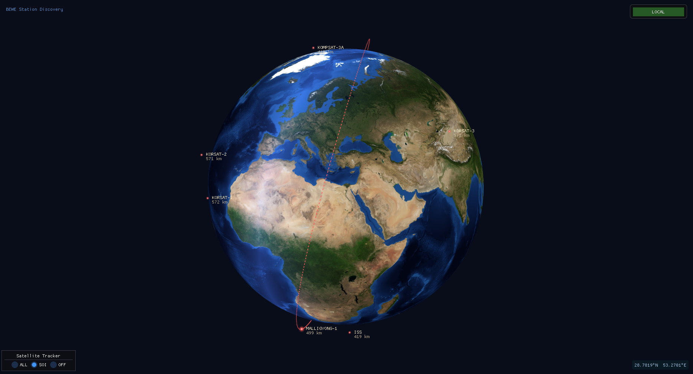
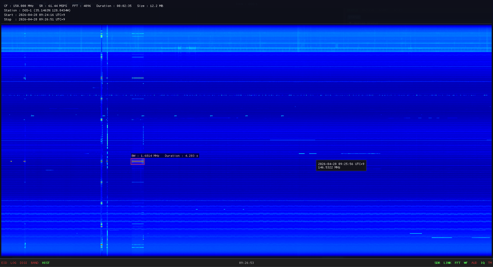

# BEWE

**Distributed SIGINT Collection and Analysis Platform**

A multi-site signals intelligence system for continuous wideband RF
surveillance, persistent waterfall archive, and cross-station emitter
characterization. Designed for sustained, unattended collection at
geographically dispersed receiver sites under a single operator command.



---

## Capability Summary

- **Distributed collection across multiple sites** under one operator
  workstation. No per-site IP configuration required.
- **Persistent waterfall archive** — every spectrum frame committed to a
  permanent record; scroll back hours, days, or months from any analyst
  workstation.
- **Mission-scoped operations** with automatic consolidation of IQ captures,
  demodulated audio, and waterfall segments under a single mission code.
- **Forensic analyst workbench** with multi-domain views and automatic
  signal characterization (PRI, PRF, pulse duration, baud, modulation).
- **Cross-station emitter library** — sightings from every site aggregate
  into a single institutional record.
- **Headless collection nodes** suitable for forward-deployed sites on
  low-power hardware (Raspberry Pi class).

---

## Operational Context

BEWE was built for organizations operating multiple receiver sites that must
behave as a single, coherent intelligence asset. The platform replaces the
common pattern of disconnected single-site collection — where each operator
maintains their own recordings, notes, and signal knowledge — with a unified
architecture in which every site contributes to one persistent archive and
one shared emitter database.

Typical deployment profiles:

- **Fixed surveillance stations** at multiple regional sites, command-and-controlled
  from a central operations room.
- **Forward-deployed collection nodes** on low-cost hardware (BladeRF / RTL-SDR on
  Raspberry Pi 5) at remote or austere locations, reporting back to a hardened
  Central Server.
- **Combined fixed + mobile** networks where an analyst workstation roams across
  active sites depending on the tasking.

The system is designed to remain operational under degraded network
conditions. Collection at each site is continuous and local; the link to
Central determines only how quickly observations propagate to the
institutional archive, not whether collection occurs.

---

## Core Capabilities

### Distributed Collection

Receiver sites publish their geographic position to Central. The operator
workstation displays all live sites as illuminated markers on a 3D globe; a
single click assumes control of the chosen site. No port or address
management is exposed to the operator. Concurrent operation of multiple sites
from one workstation is supported.


### Real-Time Surveillance

Each site presents a continuous wideband waterfall and live power spectrum
with up to ten concurrent demodulator channels. Channels persist their state
across retuning and frequency excursions.


### Persistent Waterfall Archive

Every spectrum row produced by every site is committed to a permanent archive
on the Central Server. Analysts scroll backward through hours, days, or
months of capture from the workstation. Archive files are mission-coded with
embedded station identity, geographic coordinates, and UTC bounds.



### Mission Workflow

Operations are scoped as **missions**. Each mission has an auto-generated
code (alphabetical month + day; for example `J15` = October 15). All
recordings produced during the mission — IQ, demodulated audio, hourly
waterfall segments — are tagged with the mission code and consolidated under
a single directory tree on the Central archive at mission end.

The workflow is network-resilient: collection at the site is continuous and
local, regardless of Central connectivity. When the link to Central is
interrupted, the affected segments are flagged and pushed to Central on
reconnect, restoring complete archive coverage.


### Analyst Workbench

A built-in forensic analyzer operates on any captured IQ file with nine
domain views: spectrogram, envelope, instantaneous frequency, instantaneous
phase, raw I/Q, constellation, demodulated audio, M-th power spectrum, and
demodulated bit stream.

The analyzer is intended as an emitter-identification workbench. Applications
include:

- **Emitter ID and RF fingerprinting** — verify transmitter identity across
  envelope, I/Q, phase, and frequency-domain signatures
- **Modulation recognition** — automatic preamble detection with reporting of
  PRI, PRF, pulse duration, and symbol rate
- **Digital protocol analysis** — bit-stream rendered as 2D bitmap, hex, or
  binary; frame sync patterns and periodicity become visually obvious


### Cross-Station Emitter Library

Every recording carries operator-entered metadata: frequency, modulation,
protocol, identifying tokens such as MMSI or callsign. When an operator
issues a **Report** on a recording, Central aggregates the sighting into a
unified emitter record keyed by the identifying fields. Sightings without
identifiers drop into a confirmation queue for explicit operator
adjudication — silent merges are not permitted.

Confirmed emitter records accumulate across all sites and all sessions, with
first-seen timestamp, last-seen timestamp, contributing-site list, and
operator notes consolidated on a single record. A transmission missed by one
site is filled in by another that captured it; institutional knowledge
replaces single-operator memory.


### Time Machine — Continuous IQ Buffer

A 60-second IQ buffer is maintained continuously at every site. When a
transient signal of interest has already passed, the operator freezes the
buffer, scrolls back, and exports the relevant time-frequency region as a
forensic IQ file. The operational interval between "I just saw something"
and a permanent recording is reduced to seconds.


### Multi-Window Operations

A single operator workstation may run multiple site operations concurrently,
each in its own window distributable across monitors. The 3D globe persists
as the master station selector and overall tasking view.


---

## System Architecture

```
                       ┌──────────────────────────┐
                       │      Central Server      │
                       │   Permanent archive +    │
                       │   Emitter database       │
                       └─────────────┬────────────┘
                                     │
              ┌──────────────────────┼──────────────────────┐
              │                      │                      │
       ┌──────┴───────┐       ┌──────┴───────┐       ┌──────┴───────┐
       │   Site A     │       │   Site B     │       │   Site C     │
       │   HOST +     │       │   HOST +     │       │   HOST +     │
       │   Receiver   │       │   Receiver   │       │   Receiver   │
       └──────────────┘       └──────────────┘       └──────────────┘

                       ┌──────────────────────────┐
                       │  Analyst Workstations    │
                       │  (JOIN — observe and     │
                       │   control any site)      │
                       └──────────────────────────┘
```

| Component | Role |
|---|---|
| **HOST** | Collection node. Owns the receiver; produces the live waterfall, demodulator channels, IQ captures, and HIST archive segments. Operates attended (GUI) or unattended (headless CLI). |
| **Central Server** | Single-port relay between HOST and JOIN. Holds the permanent archive of all sites and the cross-station emitter database. |
| **JOIN** | Analyst workstation. Observes and commands any authorized HOST. Multiple JOINs may share a single HOST. |

---

## Data Retention

| Tier | Retention | Notes |
|---|---|---|
| HOST local disk | Approximately 2 months, rotating | Auto-purge on mission code rollover (older monthly cohort dropped when a new month opens). Storage requirements bounded. |
| Central Server | Permanent | Bounded only by provisioned storage. The institutional system of record. |
| Analyst workstation | At operator discretion | Download cache; no automatic purge. |

The 2-month HOST retention exists to bound storage at austere or low-cost
sites. The Central archive is the system of record and is preserved
indefinitely.

---

## Receiver Compatibility

| Receiver | Frequency Coverage | Typical Application |
|---|---|---|
| Nuand BladeRF 2.0 | 47 MHz – 6 GHz | Primary wideband collection; fixed sites |
| ADALM-Pluto (AD9361) | 70 MHz – 6 GHz | Portable / forward deployment |
| RTL-SDR | 24 MHz – 1.7 GHz | Distributed low-cost coverage |

Receivers are auto-detected at startup. With no receiver attached, the
workstation runs as a JOIN-only client observing remote sites.

---

## Deployment Profile

- **Operator workstation**: Ubuntu 24.04 LTS, x86_64, GPU with OpenGL 3+
- **Headless collection node**: Raspberry Pi 5 with RTL-SDR or BladeRF;
  Raspberry Pi OS 64-bit
- **Central Server**: Ubuntu 24.04 LTS, x86_64; storage provisioned per
  retention policy
- **Network**: Single TCP port between Central and each site; mesh VPN
  (Tailscale or WireGuard) recommended for multi-site deployments over
  public networks

The full deployment procedure, including receiver permissions and
Raspberry Pi tuning, is documented in [`INSTALL.md`](INSTALL.md).

---

## Documentation

| Document | Audience |
|---|---|
| `README.md` | Program officers, procurement, operations leadership |
| [`INSTALL.md`](INSTALL.md) | Systems administrators provisioning sites and the Central Server |
| [`OPERATOR.md`](OPERATOR.md) | Analysts and shift operators (key bindings, daily workflows, troubleshooting) |

---

## Licensing

Contact for licensing inquiries.
