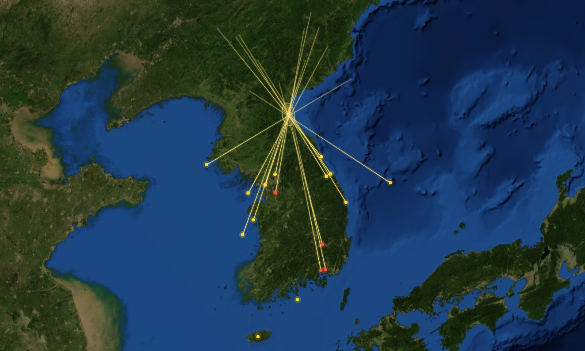
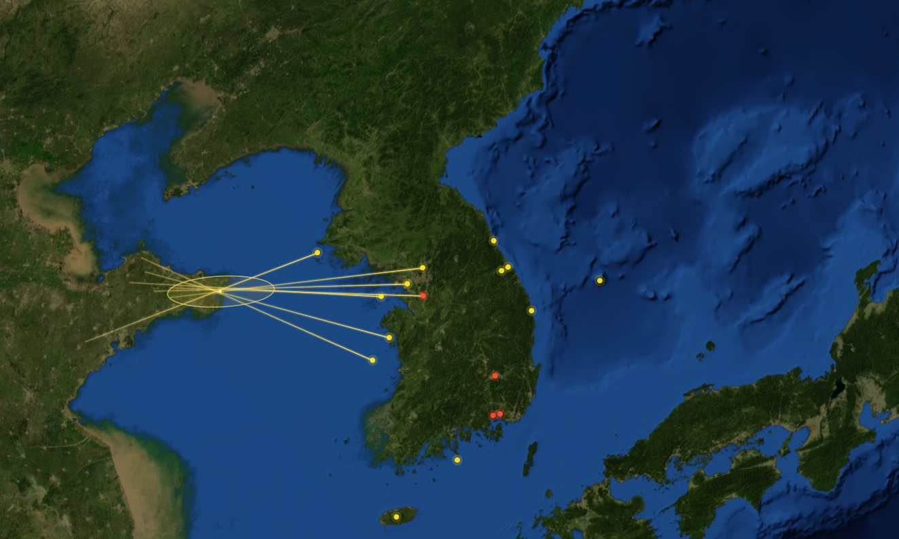
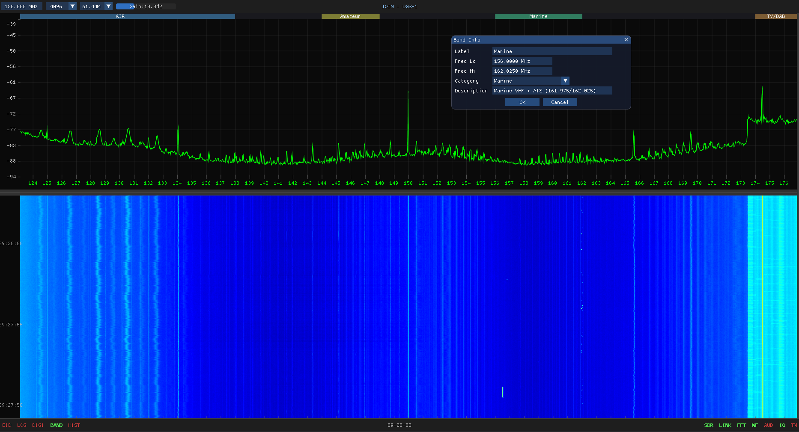

# BEWE

**SIGINT Platform**
*Behind Everyone We Hear Everything*

Wideband · Distributed · Persistent Signal Intelligence Platform


---

## Background — RF Threats Dominate the Modern Battlefield

GPS jamming · UAS infiltration · missile guidance · tactical communications.
In the modern battlefield, the first thing to arrive is not the weapon — it is the RF signal.

| Threat | Reality |
|---|---|
| **GPS Jamming** | Since 2010, North Korea has repeatedly transmitted high-power GPS jamming signals across the West Sea. A single jamming campaign disables the navigation systems of 200+ civil aircraft and disrupts the return paths of military UAS. |
| **UAS Infiltration** | North Korean small UAS have penetrated Paju (2014), Seongju (2017), and as deep as 3 km over Seoul Yongsan (2022). Radar cannot detect low-altitude low-speed aircraft — the RF control link is the only detection cue. |
| **Missile Pre-launch RF** | Ballistic and cruise missile guidance subsystems (GPS receivers, active radar seekers, telemetry) emit RF signals before launch. Capturing these emissions yields tens of seconds of pre-launch warning. |
| **Adversary Communications** | DPRK HF/VHF/UHF tactical voice, frequency-hopping digital data links, UAS control links — without distributed, persistent collection, signal patterns and adversary intent cannot be discerned. |

---

## Why SIGINT — From Defense to Pre-emption

THAAD · Patriot · Hyunmoo — all of these activate **after** an attack has begun.
No defensive system, however capable, achieves 100% interception.

The world's intelligence services operate a three-pillar collection model for pre-emptive warning: **HUMINT · IMINT · SIGINT**.

| Pillar | Means | Characteristics |
|---|---|---|
| **HUMINT** | Agents and informants | Provides deep context; long acquisition timeline |
| **IMINT** | Satellite and aerial imagery | Reveals facilities, equipment, and disposition; constrained by weather and revisit interval |
| **SIGINT** | Electromagnetic signals | Real-time read on adversary capability and intent; independent of weather, time of day, and line of sight |

**BEWE is the distributed collection and analysis platform for the SIGINT pillar.**

---

## How BEWE Complements Existing Systems

BEWE does not replace existing SIGINT assets. **It densely fills the low-altitude, persistent, distributed domain that high-cost platforms cannot economically cover.**

| Existing Limitation | BEWE Response |
|---|---|
| Stovepiped data across assets | Single Central fusion server · all-node real-time correlation |
| High-cost platform coverage ceiling | COTS nodes at low single-digit hardware cost — dense deployment along the 250 km forward line |
| Burst-signal collection gap | 60-second rolling IQ buffer · post-event replay of burst transmissions |
| Tribal knowledge dependency | Auto-accumulating emitter database · persists across personnel turnover |

---

## Platform Overview

Forward collection nodes (HOST) · analyst command and control (JOIN) · SIGINT fusion server (Central) — three tiers operating as a single platform.

```
                       ┌──────────────────────────┐
                       │      Central Server      │
                       │  Permanent archive +     │
                       │  cross-station emitter DB│
                       └─────────────┬────────────┘
                                     │
              ┌──────────────────────┼──────────────────────┐
              │                      │                      │
       ┌──────┴───────┐       ┌──────┴───────┐       ┌──────┴───────┐
       │  Station 1   │       │  Station 2   │       │  Station 3   │
       │  HOST + SDR  │       │  HOST + SDR  │       │  HOST + SDR  │
       └──────────────┘       └──────────────┘       └──────────────┘

                       ┌──────────────────────────┐
                       │  Analyst Workstations    │
                       │  (JOIN — observe and     │
                       │   command any HOST)      │
                       └──────────────────────────┘
```

| Component | Role |
|---|---|
| **HOST** | Forward collection node. Owns the receiver; produces live waterfall, demodulator channels, IQ captures, and HIST archive segments. Operates attended (GUI) or unattended (headless CLI). |
| **Central Server** | Single-port (7700) relay between HOST and JOIN. Holds the permanent archive of all sites and the cross-station emitter database. |
| **JOIN** | Analyst workstation. Observes and commands any authorized HOST. Multiple JOINs may share a single HOST simultaneously. |

---

## Core Capabilities

### Signal Emitter Direction Finding

When the same signal is received simultaneously across active collection sites, real-time direction finding identifies the location of the signal emitter on the 3D globe.

- **Multi-site Line of Bearing (LOB)** — each active site projects a bearing toward the emitter; intersecting LOBs localize the source in real time
- **On-globe emitter fix** — the estimated source position and its error ellipse are rendered live on the 3D globe alongside the collection nodes




### Tactical Communications Intercept (COMINT)

HF · VHF · UHF concurrent demodulation across ten channels — the Holding List preserves tracking regardless of where the adversary moves the frequency.

- **Ten concurrent demodulators** (AM · FM · USB · LSB · CW)
- **Real-time tactical band-plan sync** — DPRK frequency allocations, UAS control bands, satellite downlink bands defined by category and color, propagated to all JOIN analyst displays
- **Frequency-hopping (FH) capture** — 60-second rolling IQ buffer enables post-event replay and analysis



### Protocol Decode Modules (DEMOD)

Beyond raw collection, BEWE decodes the **content** of structured digital transmissions. Decode modules are licensed per subscription and activate without redeployment — a station gains a capability the moment its module is provisioned.

- **Distributed activation** — from the DEMOD panel an analyst selects a decoder and applies it to any channel filter on any station across the Central. The owning HOST performs the demodulation; decoded records fan out through Central to every subscribed JOIN (Recv).
- **Unified collection plane** — every module shares one HOST↔Central↔JOIN transport and writes a per-day archive on Central with live and historical playback. No per-module network plumbing.
- **Capability isolation** — a module absent from a build leaves no trace in the binary; provisioning its folder enables it immediately, with every other feature unaffected.

| Module | Signal | Decoded |
|---|---|---|
| **ACARS** | VHF aircraft datalink (~131 MHz) | Aircraft registration · flight · type · airline · country · message label/text · uplink/downlink direction |
| **AIS** | Maritime VHF (161.975 / 162.025 MHz) | Vessel MMSI · position · course · type · name — rendered on a 2D map overlay |
| **WiFi (802.11)** | 2.4 / 5 GHz beacons | SSID · primary channel · security (Open/WPA/WPA2) · PHY generation (11b/g/n/ac/ax) · BSSID — decoded from both 6 Mbps OFDM and 1 Mbps DSSS beacons |
| **DMR** | Digital Mobile Radio (4FSK, 12.5 kHz · UHF/VHF) | Color code · timeslot · source/destination ID (talkgroup) · call type (group/individual) · LC/CSBK opcode — Tier II conventional, FEC-verified (Golay Slot Type · BPTC(196,96) · CRC) from the 4FSK burst (signalling/metadata; AMBE voice not decoded) |

Each station presents its decoded inventory — aircraft overhead, vessels in the littoral, access points in the operational area — as a continuously updated, cross-station fused picture.

### Electronic Intelligence (ELINT) and Missile Signal Analysis

Radar, missile seeker, and telemetry signals — automatic parameter extraction across nine analysis domains.

| Domains | Outputs |
|---|---|
| Spectrogram · Freq · Amp · Phase · I/Q · Constellation · Audio · M-th Power · Bits | Auto-measured PRI · PRF · Pulse Duration · Baud · modulation type |


### GPS Jamming Source Detection and Impact Mapping

A single receive site cannot bound the jamming footprint. Only distributed nodes can produce real-time triangulation.

- **Continuous wideband GNSS monitoring** — GPS L1/L2, GLONASS, BeiDou, Galileo
- **Multi-site TDOA jamming source estimation** — not possible with single-site listening posts
- **Automatic jamming-event IQ preservation** — post-event signal characterization and admissible evidence for international filings
- **3D globe footprint visualization** — per-node signal strength mapped in real time

### Adversary Satellite Downlink Surveillance

Chinese, Russian, and DPRK ISR satellites — every overhead pass automatically captured and recorded.

- **Auto-updated TLE and pass prediction** — Celestrak catalog synchronization; collection schedule auto-populated from overflight times
- **Per-pass automatic IQ recording** — mission-coded auto-classification; signals available for Doppler-corrected modulation analysis
- **Distributed Doppler fingerprinting** — Doppler curves compared across receive sites to disambiguate satellite mission (comms / ISR / GNSS jamming)


### Persistent SIGINT Archive

A single analyst's discovery becomes a permanent enterprise asset.

- **Mission-scoped auto-classification** — mission code (e.g. A03 = January 3) anchors IQ, audio, and HIST files into a consolidated Central archive
- **Auto-accumulating emitter database** — frequency and identifying tags (MMSI, callsign, unit identifiers) drive automatic matching; unidentified signals queue for analyst adjudication
- **Knowledge transfer without rotation loss** — first-seen and last-seen timestamps, contributing stations, and analyst notes consolidated on a single record


---

## Operational Scenario — GPS Jamming Response

From the moment North Korea activates a GPS jammer to JCS notification — BEWE closes the loop in under two minutes.

| Time | THREAT | BEWE |
|---|---|---|
| **T + 0s** | GPS jammer activated. 1575 MHz high-power jamming transmitted | Three nodes detect simultaneously. Anomaly alert on L1 band · IQ buffered |
| **T + 15s** | Footprint expands. Navigation degradation across 200 km radius | TDOA triangulation. Source coordinates auto-computed · CEP <500 m |
| **T + 30s** | Aircraft anomaly reported. ATC begins receiving nav-fault reports | Signal analysis complete. Modulation parameters · auto-correlated against ESM DB |
| **T + 2min** | Jamming continues. Hours-long sustained operation possible | JCS notification packaged. Coordinates · evidentiary IQ · analysis report delivered |

---

## Data Retention

| Tier | Retention | Notes |
|---|---|---|
| HOST local disk | Approximately 2 months, rotating | Auto-purge on mission-code rollover. Bounds storage at austere or low-cost sites. |
| Central Server | Permanent | Bounded only by provisioned storage. The institutional system of record. |
| Analyst workstation | Operator discretion | Download cache; no automatic purge. |

The 2-month HOST retention exists to bound storage at forward and low-cost sites. The Central archive is the system of record and is preserved indefinitely.

---

## Security / OPSEC

| Domain | Design |
|---|---|
| **Authentication and access control** | Three analyst tiers — Tier 1 (collection) / Tier 2 (analysis) / Tier 3 (command) · per-station ID/PW authentication |
| **Data classification and isolation** | IQ · audio · HIST partitioned by mission code · local disk primary · Central download restricted to authorized analysts |
| **Audit and supply chain** | Analyst sessions and recording start times automatically logged · COTS firmware verifiable · open-source codebase available for audit |

---

## Documentation

| Document | Audience |
|---|---|
| `README.md` | Program officers, procurement, operations leadership |
| [`INSTALL.md`](INSTALL.md) | Systems administrators provisioning sites and the Central Server |
| [`OPERATOR.md`](OPERATOR.md) | Analysts and shift operators (key bindings, daily workflows, troubleshooting) |

---

## Inquiries

Procurement, technical partnership, and demonstration requests — **bewe.co.kr**
